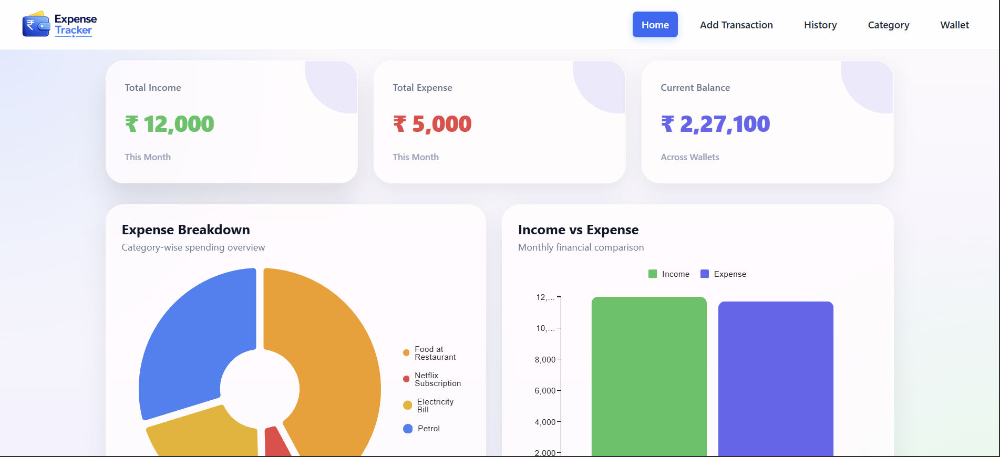

# Expense Tracker App

A modern and responsive Expense Tracker web application built using **React.js** and **Redux Toolkit** with interactive charts, wallet management, category tracking, and smooth UI design.

---

## 🌐 Live Demo

🔗 https://expense-tracker-628.netlify.app/

---

## 🚀 Features

### 💰 Transaction Management
- Add income and expense transactions
- Delete transactions
- Real-time balance updates
- Transaction history tracking

### 📊 Analytics Dashboard
- Expense breakdown using Pie Charts
- Monthly Income vs Expense Bar Graph
- Interactive financial overview

### 🏷️ Category Management
- Add custom categories
- Select custom icons and colors
- Delete categories

### 👛 Wallet Management
- Manage wallet balances
- Track overall current balance

### 🔍 Search & Filters
- Search transactions
- Filter transaction history

### 🎨 Modern UI
- Smooth and responsive interface
- Premium dashboard design
- Bootstrap styling
- Material UI Charts integration
- Custom alerts and animations

---

## 🛠️ Tech Stack

| Technology | Usage |
|---|---|
| React.js | Frontend Framework |
| Redux Toolkit | State Management |
| React Router DOM | Routing |
| Bootstrap | UI & Responsive Layout |
| Material UI Charts | Data Visualization |
| CSS Modules | Component Styling |
| React Icons | Icons |

---

## 📂 Project Structure

```bash
src/
│
├── assets/
│
├── components/
│   ├── Styles/
│   ├── AddTransaction.jsx
│   ├── Bargraph.jsx
│   ├── Category.jsx
│   ├── ColorSelector.jsx
│   ├── CustomAlert.jsx
│   ├── Footer.jsx
│   ├── Header.jsx
│   ├── History.jsx
│   ├── Home.jsx
│   ├── IconSelector.jsx
│   ├── PieChart.jsx
│   ├── TransactionItem.jsx
│   └── Wallet.jsx
│
├── store/
│   ├── categorySlice.js
│   ├── transactionSlice.js
│   ├── walletSlice.js
│   ├── totalSlice.js
│   ├── iconMap.js
│   └── store.js
│
├── App.jsx
├── App.css
└── main.jsx
```

---

## ⚙️ Redux State Management

The application uses **Redux Toolkit** for centralized and scalable state management.

### Store Slices
- `transactionSlice` → Handles transactions
- `categorySlice` → Manages categories
- `walletSlice` → Wallet data
- `totalSlice` → Income, expense & balance calculations

---

## 📈 Charts Used

### Pie Chart
Displays category-wise expense distribution.

### Bar Graph
Compares monthly income and expense using transaction dates.

Library Used:

```bash
@mui/x-charts
```

---

## 🎨 UI Design

The UI focuses on:
- Clean dashboard layout
- Soft gradient backgrounds
- Responsive design
- Card-based components
- Smooth hover effects
- Premium color theme

---

## 🧠 Learning Outcomes

Through this project, I learned:
- React component architecture
- Redux Toolkit state management
- Dynamic chart integration
- Responsive UI development
- Reusable component design
- Efficient data handling

---

## ▶️ Installation

Clone the repository:

```bash
git clone <your-repository-link>
```

Go to project folder:

```bash
cd expense-tracker
```

Install dependencies:

```bash
npm install
```

Run the development server:

```bash
npm run dev
```

---

## 📸 Screenshots

### 🏠 Dashboard



## 🔮 Future Improvements

- User Authentication
- Dark Mode
- Export Transactions to PDF/CSV
- Backend Integration
- Cloud Database
- Budget Planning System

---

## 👨‍💻 Author

**Naga Kumar**  
Undergraduate Student at IIT Kharagpur  
Passionate about Web Development and UI Design

LinkedIn:  
https://www.linkedin.com/in/nagakumar-yan/

---

## ⭐ Project Summary

Developed a modern Expense Tracker web application using React.js and Redux Toolkit featuring transaction management, category-wise analytics, wallet tracking, dynamic charts, and responsive UI using Bootstrap and Material UI Charts.
